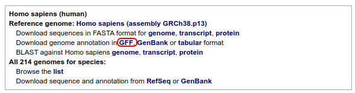

# Properon

A free and open source web application for the generation of publication-quality gene diagrams

## Key Features

* Generates clear and readable gene block diagrams
* Download generated diagrams from your browser
* Creates diagrams in the SVG format, meaning you can expand their size infinitely! No more blurry poster diagrams!
* Every aspect of the diagram, including text and colour can be tweaked in an SVG editor like [Inkscape](https://inkscape.org/)
* Runs in your browser
* Free and open source

## Usage

Properon is a free application that runs in your browser is, and can be accessed at: https://tmiguelt.github.io/Properon/.

1. Before you use Properon, you'll need to have:

    * A GFF file of the organism you wish to show in the diagram.
    Most annotation databases will provide these.
    If you are familiar with NCBI, you can find a GFF by searching in the *Genome* database.
    For example, for a human GFF, browse to https://www.ncbi.nlm.nih.gov/genome/51, and click the following link:
    

    * A region of interest to display.
      If you work with bacteria, you can find some predicted operons using [ProOpDb](http://biocomputo2.ibt.unam.mx/OperonPredictor/).  
      You'll need to note down the start and end position that you are interested in, as well as the contig (if your organism has chromosomes or plasmids)
  
2. Next, all you need to do is input this information into Properon:
    * Click "Upload GFF" and select the GFF file you found in step 1
    * A contig will be automatically selected.
     If your region of interest is not on this contig, you'll have to select the right one
    * Finally, input the start and end coordinate in the respective boxes.
      Note, the start coordinate has to be a smaller number than the end coordinate, even if you're interested in something on the reverse strand!
      
3. The plot will be generated in the "Plot" section
4. Click on "Advanced settings to access more detailed plot settings, and tweak them until the diagram is to your liking
5. Once you have finished customizing the plot, download a copy of the plot using the "Download" button
  
## What makes Properon unique?

A number of applications and libraries exist for the creation of gene diagrams.

Some programs, like [IGV](https://igv.org) are *genome viewers*, that is, they display tracks of features of the genome, such as genes, variants and/or sequencing reads.
However, genome viewers are generally optimized for genome exploration or analysis, and are not optimized for the creation of clear diagrams.

Other programs, particularly those implementing the [Synthetic Biology Open Language (SBOL)](https://sbolstandard.org/applications/) are designed for the creation of diagrams, but they intentionally are [not designed to show positional information](https://github.com/VisBOL/visbol-js/issues/109#issue-441005567).
That is: they do show genomic features in the correct positions relative to each other, but the specification doesn't allow for the display of features *to-scale*, at their precisely correct size and with the exact gaps between features.

Additionally, there are numerous libraries like [dnaplotlib](https://github.com/VoigtLab/dnaplotlib), which generate useful, to-scale diagrams.
However, these libraries generally require the user to understand their programming language in order to generate diagrams.
This is not always a reasonable assumption.

Finally, there exist commercial diagram generators, such as [SnapGene](https://www.snapgene.com/).
Some of these fulfill all of Properon's goals, but they are not free to use or modify (open source).

## Roadmap

Properon is still in beta. 
I intend to add the following features and bugfixes before its full release:

### Features
* [ ] Include stylesheet and font in SVG download, ensuring the SVG is identical in all viewers
* [ ] Allow the gene positions, names and colours to be edited in the application

### Bugs
* [ ] Add padding to prevent the stroke from clipping when there is no scale
* [ ] Fix situations where the page can get "stuck", and not re-render changes to the * diagram until you scroll the page, or change a setting
* [ ] Fix the gene labels being cut off on noncompliant SVG viewers, such as Microsoft Office

## Feedback

If you have a feature request or a bug report, please make a GitHub issue [here](https://github.com/TMiguelT/Properon/issues).

All other enquiries can be directed to ttmigueltt@gmail.com.
